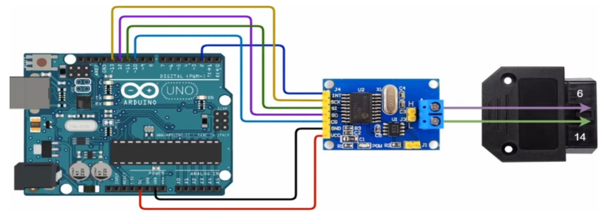
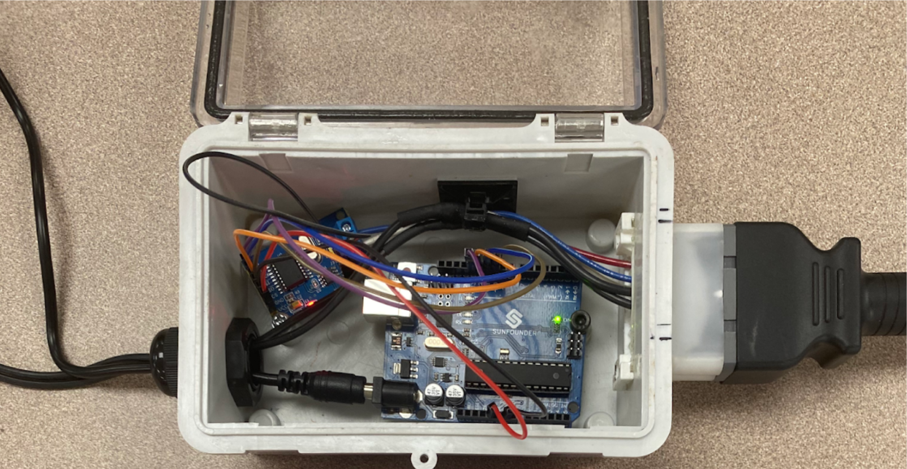
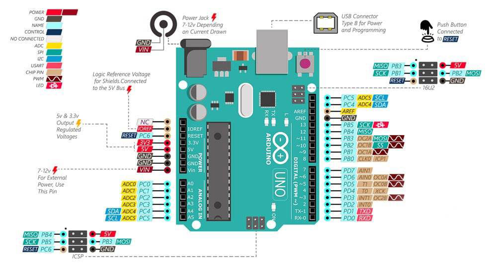

This program lets the user know if a device can properly send and recieve CAN data frames.

It does this using a CAN bus module that allows the Arduino Uno to communicate with the device over the CAN High/Low pins of the OBD port.

---

## Materials
- Arduino Uno R3
- MCP2515 CAN Bus Module
- OBDII Female Port
- Power Supplies
- Jumper Wires

## Wiring


Also note that, when not being programmed, the Uno is powered with an external 9V 3A power supply. Also, depending on the device you are testing, it will also need to be powered to sense that it is currently connected to something (our box). You will need an extra power supply for this. Or if you have a larger power supply you can use a simple voltage divider circuit. For example, if you have a device that normally requires 12V, then you can use one 20V power supply. The 20V would split to be 9V for the Arduino and 12V for the device. In my experience, if the device was not being powered and I sent it some frames, I would get no response back from the device. So try powering your device as well.


Here is an example of what I am talking about. 2 Power Supplies (or just one with a voltage divider).


This is the pinout for the Arduino Uno R3 board. If you would like to use a different Uno board, make sure to check your own pinout online.

---

## Software
You only need the Arduino IDE for this project.

### Source Code
See all code and setup instructions in my GitHub repository:
https://github.com/Mohamed1628/CAN-Troubleshooter

```c++
#include <mcp_can.h>
#include <SPI.h>

long unsigned int rxId;
unsigned char len = 0;
unsigned char rxBuf[8];
char msgString[128];                            // Array to store serial string

#define CAN0_INT 2                              // Set INT to pin 2 (this pin is optional; just an interrupt pin)
MCP_CAN CAN0(10);                               // Set CS to pin 10 (required)

void setup() {
  Serial.begin(115200);
  
  // Initialize MCP2515 running at 16MHz with a baudrate of 500kb/s and the masks and filters disabled.
  if(CAN0.begin(MCP_ANY, CAN_500KBPS, MCP_16MHZ) == CAN_OK) // Might need to change baud rate for your device
    Serial.println("MCP2515 Initialized Successfully!");
  else
    Serial.println("Error Initializing MCP2515...");
  
  CAN0.setMode(MCP_NORMAL);                     // Set operation mode to normal so the MCP2515 sends acks to received data.

  pinMode(CAN0_INT, INPUT);                     // Configuring pin for /INT input
  
  Serial.println("MCP2515 Library Receive Example...");
}

// Defining the message we are going to send to the device
byte data[8] = {0x00, 0x01, 0x02, 0x03, 0x04, 0x05, 0x06, 0x07};
int ID = 0x18DAF110; // works with standard and extended CAN IDs

void loop() {
  // Here we are sending a CAN data frame to the device from the ID, defined earlier
  CAN_Send(ID, data); // Ex: CAN_Send(0x18DB33F1, data)

  // To send multiple frames in a row:
  CAN_Send(ID, data);
  CAN_Send(ID, data);
  CAN_Send(ID, data);  

  // Next we are reading CAN data frames response in from the device
  CAN_Read();
}

void CAN_Send(int ID, byte data[8]) {
  // send data:  ID = 0x100, Standard CAN Frame (0), Data length = 8 bytes, 'data' = array of data bytes to send
  byte sndStat = CAN0.sendMsgBuf(ID, 0, 8, data);
  if(sndStat == CAN_OK) {
    Serial.println("Message Sent Successfully!");
  } else {
    Serial.println("Error Sending Message...");
  }
  delay(100);   // send data per 100ms
}

void CAN_Read() {
  if(!digitalRead(CAN0_INT)) {                // If CAN0_INT pin is low, read receive buffer
    CAN0.readMsgBuf(&rxId, &len, rxBuf);      // Read data: len = data length, buf = data byte(s)
    
    if((rxId & 0x80000000) == 0x80000000)     // Determine if ID is standard (11 bits) or extended (29 bits)
      sprintf(msgString, "Extended ID: 0x%.8lX  DLC: %1d  Data:", (rxId & 0x1FFFFFFF), len);
    else
      sprintf(msgString, "Standard ID: 0x%.3lX       DLC: %1d  Data:", rxId, len);
  
    Serial.print(msgString);
  
    if((rxId & 0x40000000) == 0x40000000) {    // Determine if message is a remote request frame.
      sprintf(msgString, " REMOTE REQUEST FRAME");
      Serial.print(msgString);
    } else {
      for(byte i = 0; i<len; i++){
        sprintf(msgString, " 0x%.2X", rxBuf[i]);
        Serial.print(msgString);
      }
    }
        
    Serial.println();
  }
}
```

### Included Libraries
- mcp_can by coryjfowler (1.5.1 as of March 2024)
- SPI by Arduino
---