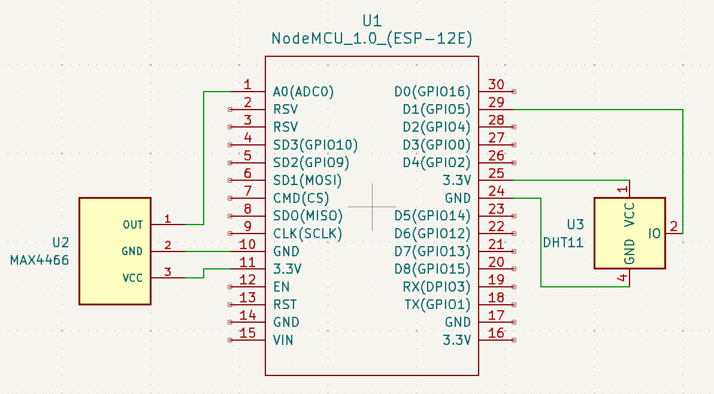
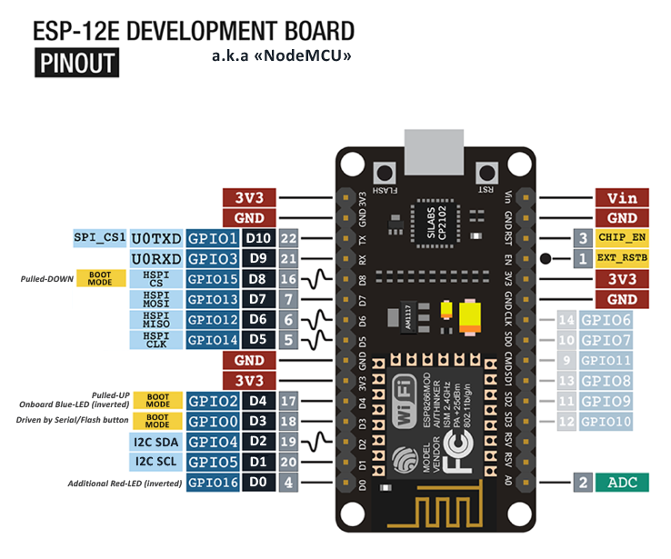

This program lets the user know:
- When a cycle finished
- When a cycle **will** finish
- When the door was opened
It does this using a microphone sensor to listen for the dinging noise at the end of a cycle as well as a humidity sensor to measure when the humidity spikes indicating that steam/vapor is coming out of a freshly opened washing machine. This of course is very simple 
---
## Materials
- ESP8266 NodeMCU ESP-12E 1.0
- Electret Microphone Amplifier MAX4466 Module
- DHT11 Temperature-Humidity Sensor Module
- Jumper Wires

## Wiring
4 LEDs (Red, Green, Blue, Yellow) to represent 4 packet types (ICMP, TCP, UDP, and Other). Any GPIO pins can be used, in this case, GPIO 2, 5, 21, and 23 were used (NodeMCU ESP-12E). The 220 Ω Resistors are optional.

This is the pinout for the ESP8266 NodeMCU ESP-12E board. If you would like to use a different ESP8266 board, make sure to check your own pinout online.
---

## Software
- Arduino Cloud
- Arduino Create Agent

### Source Code
See all code and setup instructions in my GitHub repository:
https://github.com/Mohamed1628/Washing-Machine-Status

### YouTube Demonstration + Explanation


---