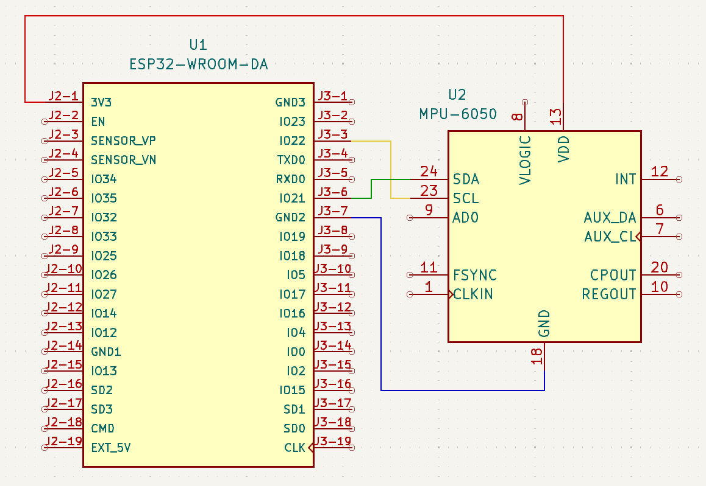
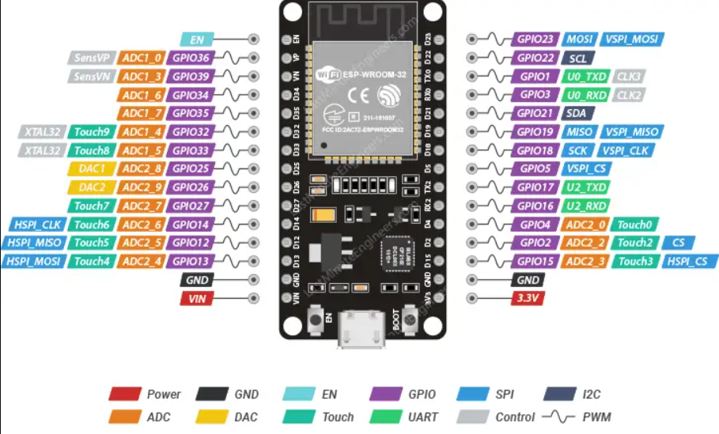

This program can be used to visualize incoming accelerometer and gyroscope data from an MPU-6050. It does this by using an ESP32 to host a web server. The server exhibits a prism whose 3D rotation is based on the orientation of the accelerometer. This program was originally made using Visual Studio Code and the extension PlatformIO. However, it still uses the Arduino framework, so if needed the Arduino IDE can be used*.

*Tutorial can be found [here](https://randomnerdtutorials.com/esp32-mpu-6050-web-server/).

To keep the error from accumulating, a simple Kalman Filter is used on the pitch and roll angles. The reason it was not done for the yaw angle (z axis) is because it is not mathematically possible to directly solve for the yaw angle from only the gravitational accelerations in the x, y, and z axes. This is important because for the most basic version of the Kalman Filter to work, it needs to be able to have a physical equation that can create an estimate for that value. This is why many modern accelerometers nowadays come with magnetometers (basically a compass) which can directly measure the accelerometer's heading or yaw angle.

---
## Materials
- ESP32 DevKit V1 (ESP32-WROOM-32)
- Micro-USB Cable*
- MPU-6050
- Breadboard
- Jumper Wire(s)

*Must be capable of data transmission for uploading; can **not** be a power only cable

## Wiring
The ESP32 communicates with the MPU-6050 using I2C. Simply connect the SCL/SDA pins of the ESP32 and MPU-6050 together, supply it with 3.3 V, and connect it to ground.




This is the pinout for the ESP32-WROOM-32 board. If you would like to use a different ESP32 board, make sure to check your own pinout online.

## YouTube Demonstration


---

## Software
**Option 1:**
- Visual Studio Code
- PlatformIO

**Option 2:**
- Arduino IDE

### Source Code
See all code and setup instructions in my GitHub repository:
https://github.com/Mohamed1628/Kalman-Filter-MPU6050
```c
#include <Arduino.h>
#include <WiFi.h>
#include <AsyncTCP.h>
#include <ESPAsyncWebServer.h>
#include <Adafruit_MPU6050.h>
#include <Adafruit_Sensor.h>
#include <Arduino_JSON.h>
#include "LittleFS.h"
#include "KalmanFilter.h"

// Declare functions
void initMPU();
void initLittleFS();
void initWiFi();
String getGyroReadings();
String getAccReadings();
String getTemperature();


// Replace with your network credentials
// Note: ESP32 will not connect with ssid such as "John's iPhone"; Change your ssid to be "Johns iPhone" for example (no apostrophe)
const char* ssid = "YOUR_WIFI_NAME";
const char* password = "YOUR_WIFI_PASSWORD";

// Create AsyncWebServer object on port 80
AsyncWebServer server(80);

// Create an Event Source on /events
AsyncEventSource events("/events");

// Json Variable to Hold Sensor Readings
JSONVar readings;

// Timer variables
unsigned long lastTime = 0;  
unsigned long lastTimeTemperature = 0;
unsigned long lastTimeAcc = 0;
unsigned long gyroDelay = 10;
unsigned long temperatureDelay = 1000;
unsigned long accelerometerDelay = 200;

// Create a sensor object
Adafruit_MPU6050 mpu;

sensors_event_t a, g, temp;

float gyroX = 0;
float gyroY = 0;
float gyroZ = 0;

float estimateGyroX = 0;
float estimateGyroY = 0;

float accX, accY, accZ;
float temperature;

KalmanFilter kalmanX(0.001, 0.003, 0.03);
KalmanFilter kalmanY(0.001, 0.003, 0.03);
KalmanFilter kalmanz(0.001, 0.003, 0.03);

float kalX = 0;
float kalY = 0;
float kalZ = 0;

// Initialize MPU6050
void initMPU(){
  if (!mpu.begin()) {
    Serial.println("Failed to find MPU6050 chip");
    while (1) {
      delay(10);
    }
  }
  Serial.println("MPU6050 Found!");
}

void initLittleFS() {
  if (!LittleFS.begin()) {
    Serial.println("An error has occurred while mounting LittleFS");
  }
  Serial.println("LittleFS mounted successfully");
}

// Initialize WiFi
void initWiFi() {
  WiFi.mode(WIFI_STA);
  WiFi.begin(ssid, password);
  Serial.println("");
  Serial.print("Connecting to WiFi...");
  while (WiFi.status() != WL_CONNECTED) {
    Serial.print(".");
    delay(1000);
  }
  Serial.println("");
  Serial.println(WiFi.localIP());
}

String getGyroReadings(){
  mpu.getEvent(&a, &g, &temp);
  
  accX = a.acceleration.x;
  accY = a.acceleration.y;
  accZ = a.acceleration.z;

  gyroX = g.gyro.x;
  gyroY = g.gyro.y;

  // Calculate rotational velocities for X and Y axis (rad/s)
  estimateGyroY = -atan2(accX, sqrt(accY*accY + accZ*accZ));
  estimateGyroX  = atan2(accY, accZ);

  // Kalman filter
  kalY = kalmanY.update(estimateGyroY, gyroY);
  kalX = kalmanX.update(estimateGyroX, gyroX);
  
  // No trigonometric equation exists to calculate rotational velocity in the z direction given gravitation accelerations
  // To simplify things, we check if the value is bigger than the rotation velocity when the accelerometer is static (not moving)
  // If that is true, then we consider that we have a valid reading, as in the accelerometer is non-static (is moving)
  float gyroZ_temp = g.gyro.z;
  if(abs(gyroZ_temp) > 0.03) {
    // current angle (rad) = last angle (rad) + angular velocity (rad/s) * time(s)
    gyroZ += gyroZ_temp * 0.01;
  }

  readings["gyroX"] = String(kalX);
  readings["gyroY"] = String(kalY);
  readings["gyroZ"] = String(gyroZ);

  String jsonString = JSON.stringify(readings);
  return jsonString;
}

String getAccReadings(){
  mpu.getEvent(&a, &g, &temp);
  // Get current acceleration values
  accX = a.acceleration.x;
  accY = a.acceleration.y;
  accZ = a.acceleration.z;
  readings["accX"] = String(accX);
  readings["accY"] = String(accY);
  readings["accZ"] = String(accZ);
  String accString = JSON.stringify (readings);
  return accString;
}

String getTemperature(){
  mpu.getEvent(&a, &g, &temp);
  temperature = temp.temperature;
  return String(temperature);
}

void setup() {
  Serial.begin(115200);
  initWiFi();
  initLittleFS();
  initMPU();

  // Handle Web Server
  server.on("/", HTTP_GET, [](AsyncWebServerRequest *request){
    request->send(LittleFS, "/index.html", "text/html");
  });

  server.serveStatic("/", LittleFS, "/");

  server.on("/reset", HTTP_GET, [](AsyncWebServerRequest *request){
    gyroX=0;
    gyroY=0;
    gyroZ=0;
    request->send(200, "text/plain", "OK");
  });

  server.on("/resetX", HTTP_GET, [](AsyncWebServerRequest *request){
    gyroX=0;
    request->send(200, "text/plain", "OK");
  });

  server.on("/resetY", HTTP_GET, [](AsyncWebServerRequest *request){
    gyroY=0;
    request->send(200, "text/plain", "OK");
  });

  server.on("/resetZ", HTTP_GET, [](AsyncWebServerRequest *request){
    gyroZ=0;
    request->send(200, "text/plain", "OK");
  });

  // Handle Web Server Events
  events.onConnect([](AsyncEventSourceClient *client){
    if(client->lastId()){
      Serial.printf("Client reconnected! Last message ID that it got is: %u\n", client->lastId());
    }
    // send event with message "hello!", id current millis
    // and set reconnect delay to 1 second
    client->send("hello!", NULL, millis(), 10000);
  });
  server.addHandler(&events);

  server.begin();
}

void loop() {
  if ((millis() - lastTime) > gyroDelay) {
    // Send Events to the Web Server with the Sensor Readings
    events.send(getGyroReadings().c_str(),"gyro_readings",millis());
    lastTime = millis();
  }
  if ((millis() - lastTimeAcc) > accelerometerDelay) {
    // Send Events to the Web Server with the Sensor Readings
    events.send(getAccReadings().c_str(),"accelerometer_readings",millis());
    lastTimeAcc = millis();
  }
  if ((millis() - lastTimeTemperature) > temperatureDelay) {
    // Send Events to the Web Server with the Sensor Readings
    events.send(getTemperature().c_str(),"temperature_reading",millis());
    lastTimeTemperature = millis();
  }
}
```
---