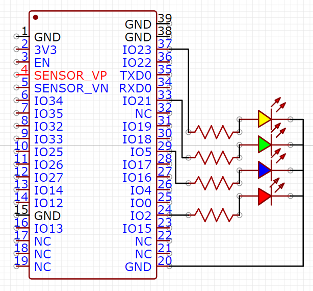

This program can be used to see TCP, UDP, ICMP, and other incoming packets to an ESP32 board that is connected to a WiFi network. A different color LED is also turned on when different protocol packets are received (red for ICMP, green for TCP, blue for UDP, and yellow for others). It also outputs the source IP address of each packet. This program uses Visual Studio Code and two extensions: ESP-IDF (Espressif IoT Development Framework) and PlatformIO.

## Wiring
4 LEDs (Red, Green, Blue, Yellow) to represent 4 packet types (ICMP, TCP, UDP, and Other). Any GPIO pins can be used, in this case, GPIO 2, 5, 21, and 23 were used.

---

## Software
- Virtual Studio Code
- ESP-IDF
- PlatformIO

---