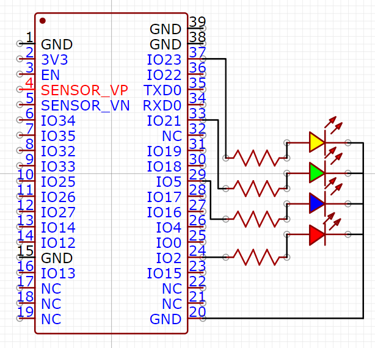
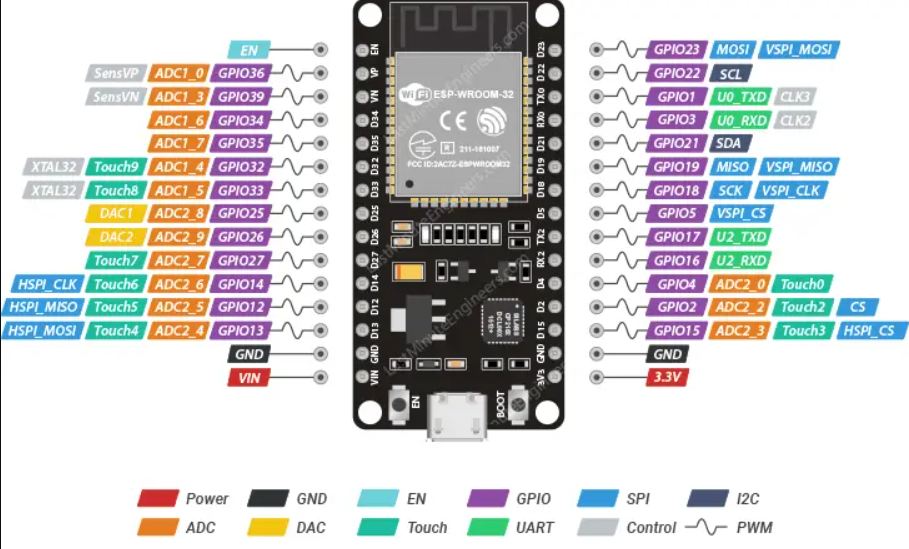

This program can be used to see TCP, UDP, ICMP, and other incoming packets to an ESP32 board that is connected to a WiFi network. A different color LED is also turned on when different protocol packets are received (red for ICMP, green for TCP, blue for UDP, and yellow for others). It also outputs the source IP address of each packet. This program uses Visual Studio Code and two extensions: ESP-IDF (Espressif IoT Development Framework) and PlatformIO.

---
## Materials
- ESP32 DevKit V1 (ESP32-WROOM-32)
- 4 LEDs
- Breadboard
- 220 Ω Resistors (optional)
- Jumper Wire(s)

## Wiring
4 LEDs (Red, Green, Blue, Yellow) to represent 4 packet types (ICMP, TCP, UDP, and Other). Any GPIO pins can be used, in this case, GPIO 2, 5, 21, and 23 were used (ESP32-WROOM-32). The 220 Ω Resistors are optional.




This is the pinout for the ESP32-WROOM-32 board. If you would like to use a different ESP32 board, make sure to check your own pinout online.

---

## Software
- Virtual Studio Code
- ESP-IDF
- PlatformIO

### Source Code
See all code and setup instructions in my GitHub repository:
https://github.com/Mohamed1628/ESP32-WiFi-Packets
```c
#include "lwip_hooks.h" // our custom header file

#include <stdio.h>
#include "freertos/FreeRTOS.h"
#include "freertos/task.h"
#include "freertos/timers.h"
#include "freertos/event_groups.h"
#include "esp_wifi.h"
#include "esp_log.h"
#include "nvs_flash.h"
#include "esp_netif.h"
#include "esp_http_server.h"
#include "driver/gpio.h"

#define SSID "NETWORK NAME" // apostrophes will not work in SSID (i.e. John's iPhone) --> (John iPhone)
#define PASS "PASSWORD"

static void wifi_event_handler(void *event_handler_arg, esp_event_base_t event_base, int32_t event_id, void *event_data)
{
    switch (event_id)
    {
    case WIFI_EVENT_STA_START:
        printf("WiFi connecting WIFI_EVENT_STA_START ... \n");
        break;
    case WIFI_EVENT_STA_CONNECTED:
        printf("WiFi connected WIFI_EVENT_STA_CONNECTED ... \n");
        break;
    case WIFI_EVENT_STA_DISCONNECTED:
        printf("WiFi lost connection WIFI_EVENT_STA_DISCONNECTED ... \n");
        break;
    case IP_EVENT_STA_GOT_IP:
        printf("WiFi got IP ... \n\n");
        break;
    default:
        break;
    }
}

void wifi_connection()
{
    nvs_flash_init();
    esp_netif_init();                    
    esp_event_loop_create_default();     
    esp_netif_create_default_wifi_sta();
    wifi_init_config_t wifi_initiation = WIFI_INIT_CONFIG_DEFAULT();
    esp_wifi_init(&wifi_initiation); 
    esp_event_handler_register(WIFI_EVENT, ESP_EVENT_ANY_ID, wifi_event_handler, NULL);
    esp_event_handler_register(IP_EVENT, IP_EVENT_STA_GOT_IP, wifi_event_handler, NULL);
    wifi_config_t wifi_configuration = {
        .sta = {
            .ssid = SSID,
            .password = PASS}};
    esp_wifi_set_config(ESP_IF_WIFI_STA, &wifi_configuration);
    esp_wifi_set_mode(WIFI_MODE_STA);
    esp_wifi_start();
    esp_wifi_connect();
}

static esp_err_t post_handler(httpd_req_t *req)
{
    vTaskDelay(1000 / portTICK_PERIOD_MS);
    httpd_resp_send(req, "URI POST Response ... from ESP32", HTTPD_RESP_USE_STRLEN);
    return ESP_OK;
}

void server_initiation()
{
    httpd_config_t server_config = HTTPD_DEFAULT_CONFIG();
    httpd_handle_t server_handle = NULL;
    httpd_start(&server_handle, &server_config);
    httpd_uri_t uri_post = {
        .uri = "/",
        .method = HTTP_POST,
        .handler = post_handler,
        .user_ctx = NULL};
    httpd_register_uri_handler(server_handle, &uri_post);
}

const char *get_protocol(u16_t type)
{
    switch (type)
    {
    case 1:
        // Red LED is ICMP
        gpio_set_direction(GPIO_NUM_2, GPIO_MODE_OUTPUT);
        gpio_set_level(GPIO_NUM_2,1);
        vTaskDelay(10);      
        gpio_set_level(GPIO_NUM_2,0);  
        return "ICMP";
    case 6:   
        // Green LED is TCP
        gpio_set_direction(GPIO_NUM_21, GPIO_MODE_OUTPUT);
        gpio_set_level(GPIO_NUM_21,1);
        vTaskDelay(10);      
        gpio_set_level(GPIO_NUM_21,0);       
        return "TCP";
    case 17:
        // Blue LED is UDP
        gpio_set_direction(GPIO_NUM_5, GPIO_MODE_OUTPUT);
        gpio_set_level(GPIO_NUM_5,1);
        vTaskDelay(10);      
        gpio_set_level(GPIO_NUM_5,0);       
        return "UDP";
    default:
        // Yellow LED is Other
        gpio_set_direction(GPIO_NUM_23, GPIO_MODE_OUTPUT);
        gpio_set_level(GPIO_NUM_23,1);
        vTaskDelay(10);      
        gpio_set_level(GPIO_NUM_23,0);       
        return "-";
    }
}

int lwip_hook_ip4_input(struct pbuf *pbuf, struct netif *input_netif)
{
    const struct ip_hdr *iphdr;
    char ip_address[IP_HLEN];

    iphdr = (struct ip_hdr *)pbuf->payload;
    
    // Formatting Terminal Output
    sprintf(ip_address, "%d.%d.%d.%d", ip4_addr1_16_val(iphdr->src), ip4_addr2_16_val(iphdr->src), ip4_addr3_16_val(iphdr->src), ip4_addr4_16_val(iphdr->src));
    ESP_LOGI("HOOK", "%s: %s",
             get_protocol((u16_t)IPH_PROTO(iphdr)), ip_address);
    return ESP_OK;
}

void app_main(void) {
  wifi_connection();
  server_initiation();
}
```

### YouTube Demonstration + Explanation


---