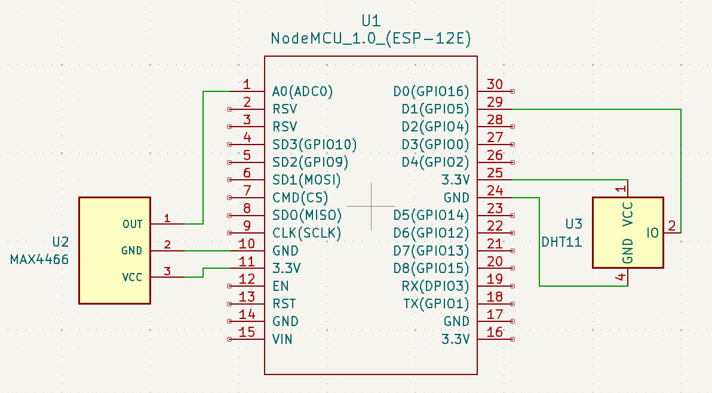
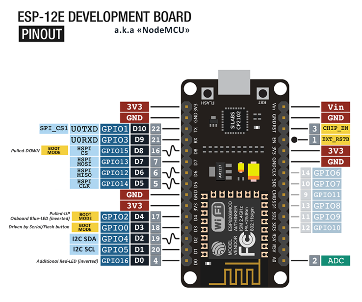

This program lets the user know:
- When a cycle **will** finish
- When a cycle finished
- When the door was opened
It does this using a microphone sensor to listen for the dinging noise at the end of a cycle as well as a humidity sensor to measure when the humidity spikes indicating that steam/vapor is coming out of a freshly opened washing machine. This of course is very simple 
---
## Materials
- ESP8266 NodeMCU ESP-12E 1.0
- Electret Microphone Amplifier MAX4466 Module
- DHT11 Temperature-Humidity Sensor Module
- Jumper Wires

## Wiring
---
The DHT11 humidity sensor and microphone module are both powered with 3.3V pins. For the humidity sensor, any GPIO pins can be used. In this case, D1 (GPIO 5) was used. The microphone module, however, must be connected to the one and only analog pin on the NodeMCU which is the A0 pin (GPIO 17).


This is the pinout for the ESP8266 NodeMCU ESP-12E board. If you would like to use a different ESP8266 board, make sure to check your own pinout online.
---

## Software
- Arduino Cloud
- Arduino Create Agent

### Source Code
See code and setup instructions in my GitHub repository:
https://github.com/Mohamed1628/Washing-Machine-Status

```c++
#include "thingProperties.h"
#include "DHT.h"
#define DHTPIN 5
#define DHTTYPE DHT11

DHT dht(DHTPIN, DHTTYPE);

const int micPin = 17;                 // analog pin used for microphone data pin
int sound;                             // integer to store value from microphone
int humidity;                          // integer to store value from humidity sensor
const int audioThreshold = 700;        // threshold value that cycle complete tone should surpass
const int humidityThreshold = 96;      // threshold value that steam from open washer should surpass

void setup() {
  // Initialize serial and dht sensor:
  Serial.begin(9600); //9600 is baud rate
  dht.begin();
  delay(1500); 

  // Defined in thingProperties.h
  initProperties();
  pinMode(micPin, INPUT); //setting microphone pin as input
 
  // Connect to Arduino IoT Cloud
  ArduinoCloud.begin(ArduinoIoTPreferredConnection);
  
  cycleStatus = false;                 // initializing cycle status to false (cycle just started)
  doorStatus = false;                  // initializing door status to false (door should be closed initially)

  setDebugMessageLevel(2);
  ArduinoCloud.printDebugInfo();
}

void loop() {
  ArduinoCloud.update();
  float h = dht.readHumidity();
  sound = analogRead(micPin);          // reading in microphone values to variable sound
  humidity = h;                        // reading in humidity values to variable humidity

  // Uncomment to see sensor values for adjusting threshold
  // Serial.println("Sound: ");         
  // Serial.print(sound);
  // Serial.println("Humidity: ");
  // Serial.println(humidity);  
  
  // if sound is still below threshold then do nothing
  if (sound < audioThreshold) {
    // do nothing...
  } 
  
  // else set status to true
  else if (cycleStatus == false) {
    cycleStatus = true; //complete tone was played
    completeTime = ArduinoCloud.getLocalTime();
  }
    
  else {
    // do nothing since cycleStatus is already true or not above threshold
  }
  
  // if humidity is still below threshold then do nothing
  if (humidity < humidityThreshold) {
    //do nothing...
  } 
    
  // else set status to true
  else if (doorStatus == false) {
    doorStatus = true; //door is open
    openTime = ArduinoCloud.getLocalTime();
  } 
  else {
    // do nothing since doorStatus is already true or not above threshold
  }
  
}

void onCycleTimeChange()  {

  completeTime = ArduinoCloud.getLocalTime() + (cycleTime*60) - (0.001*millis()); 
  // current time + cycle time - offset of how long arduino has been running

  // For example:
  // Let's say true start time was 12:00pm
  // 12:05pm + 45 minute cycle = 12:50 - 5 minutes arduino has been running = 12:45pm
}
```

### YouTube Demonstration + Explanation


---